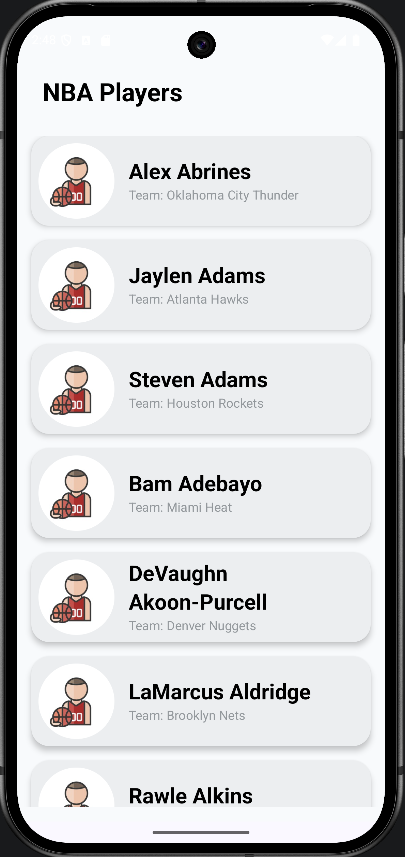
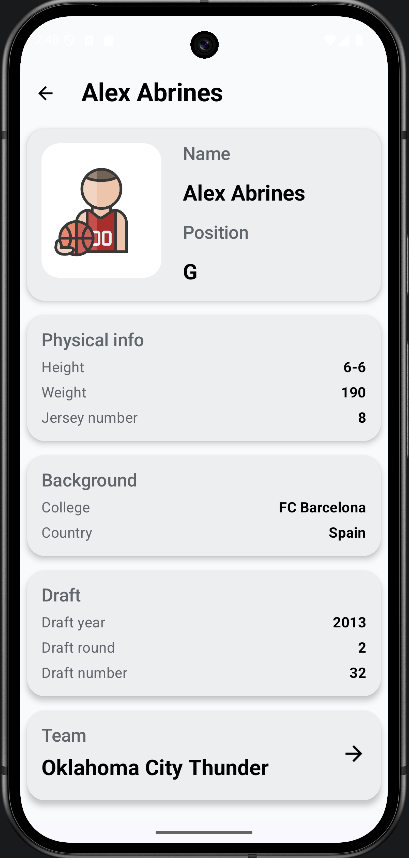
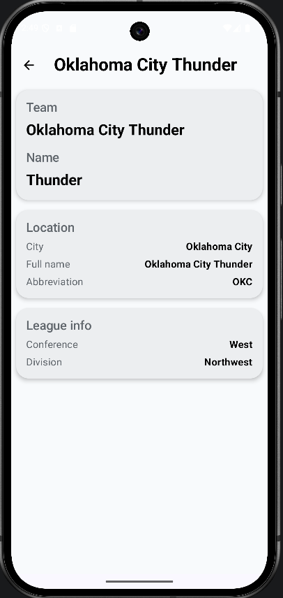
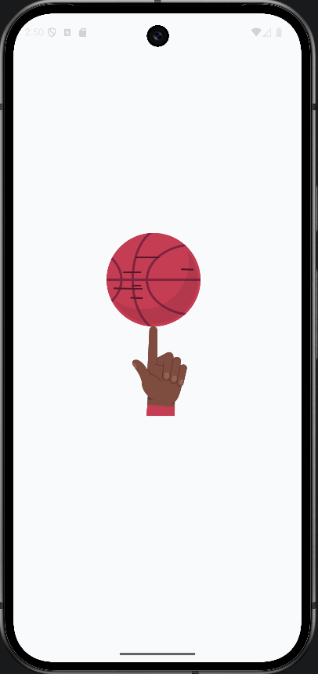

# NBA Integra

NBA Integra is a small Android app built with Kotlin and Jetpack Compose.

The app shows a list of NBA players with basic information such as first name, last name, position, and team. When the user scrolls to the end of the list, the app loads the next page of players.

After selecting a player, the user can open a player detail screen with more information. From the player detail screen, it is also possible to open the team detail screen.

The data is loaded from the [balldontlie API](https://app.balldontlie.io/).

## What was added

The app saves loaded players locally using Room.

Player and team details are opened from locally saved data instead of making extra API requests for every detail screen. This helps reduce the number of API calls and helps avoid unnecessary rate limit errors.

The player list also has a simple cache fallback. If the API is temporarily unavailable or returns a rate limit error, the app tries to show already saved players from local storage.

The app also checks the internet connection. If there is no connection, the user sees a dialog with an option to open network settings.

1. The app loads a page of players from the API
2. The loaded players are saved locally
3. The list is shown on the screen
4. When the user opens player details, the app takes the player from local storage
5. When the user opens team details, the app takes team information from locally saved player data
6. If the API request for the player list fails, the app tries to show saved players from Room
7. If there is no internet connection, the app shows a dialog and allows the user to open network settings

## Screenshots

<p align="center">
  
  
  
  
</p>

## Tech stack

* Kotlin
* Jetpack Compose
* MVVM
* Clean Architecture approach
* Navigation 3
* Retrofit
* OkHttp
* Koin
* Paging 3
* Room
* Glide
* Lottie
* ktlint

## Project structure

The project is split into several modules:

* `app` — UI, navigation, ViewModels, application setup, Room database setup, network connection monitoring
* `domain` — domain models, repository interfaces, use cases
* `data` — API models, Retrofit API, repository implementations, paging logic, local DAO/entities
* `di` — Koin modules for dependency injection

## Data loading

The player list is loaded from the API with pagination. Each page contains 35 players.

The app uses Paging 3, so the next page is loaded when the user scrolls close to the end of the list.

Loaded players are also saved locally. This local data is used for player details and team details.

If the app receives an API error, for example because of the API rate limit, it tries to show already saved players from Room.

This is a simple offline-first style implementation made for demonstration in a test project. It was added mainly because the balldontlie API has rate limits, and using local data helps reduce repeated API calls.

Important note: in offline mode, the app can only show pages that were already loaded and saved before. New pages will not be loaded while the API is unavailable.

## Internet connection handling

The app observes the current network state.

If the device has no internet connection, the app shows a simple dialog. From this dialog, the user can open network settings and enable Wi-Fi or mobile data.

Saved data may still be available without internet, but new pages cannot be loaded until the connection is restored.

## API key setup

This project uses the `balldontlie` API, so an API key is required.

To run the app locally:

1. Create an account and get an API key from https://app.balldontlie.io/
2. Create a `local.properties` file in the root of the project
3. Add your API key:

```properties
BALLDONTLIE_API_KEY=your_api_key_here
```

The real API key is not committed to the repository for security reasons and to demonstrate good practice for a test task.

You can also check `local.properties.example` to see the required property name.

## How to run

1. Clone the repository
2. Open the project in Android Studio
3. Add your API key to `local.properties`
4. Sync Gradle
5. Run the app on an emulator or a real device

## Code style

The project uses ktlint for code style checks.

Run check:

```bash
./gradlew ktlintCheck
```

Run auto-format:

```bash
./gradlew ktlintFormat
```

## Notes

This project was created as a test task.

The main focus is on clean project structure, readable code, Jetpack Compose UI, simple navigation, paginated loading, local data saving, basic offline behavior, internet connection handling, and correct API integration.
